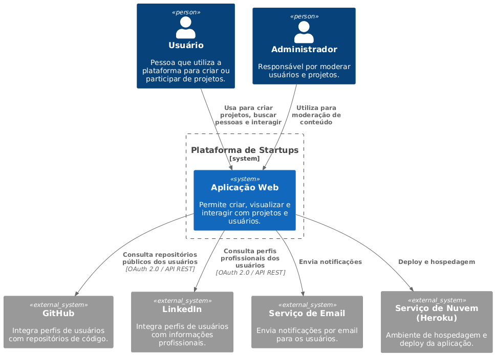
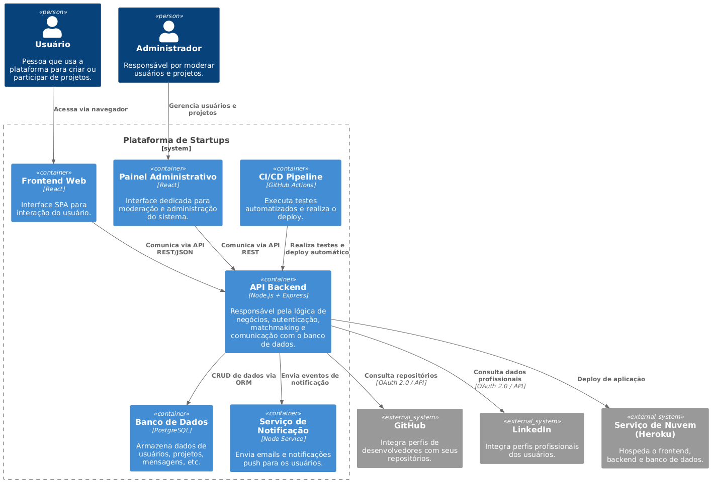
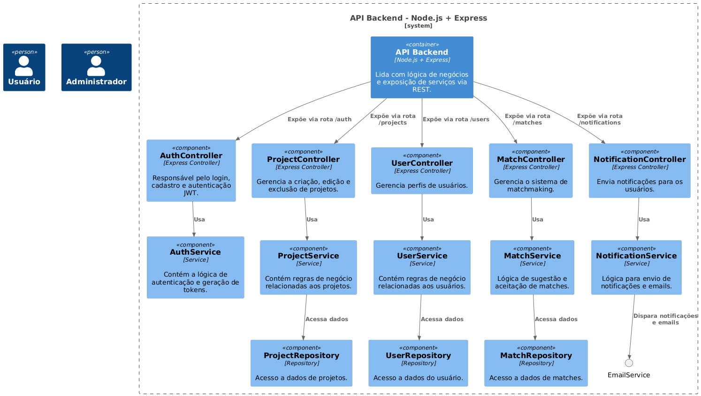
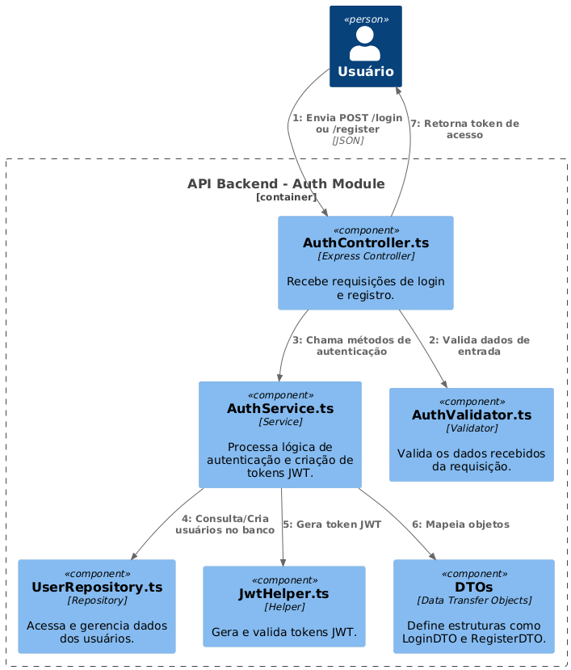

# Web Aplicação de Divulgação e Colaboração de Startups

**Autor**: Alexandre Tessaro Vieira  
**Curso**: Engenharia de Software  
**Data**: 01/01/2025

---

## Resumo

Este documento descreve o desenvolvimento de uma aplicação no qual tem como objetivo conectar ideias a pessoas para a criação de startups. Primordialmente, a aplicação permitirá a divulgação de ideias de projeto e facilitará a formação de equipes, criando assim uma ponte entre ideias e pessoas. Pretende-se usar tecnologias novas como React, Node.js e PostgreSQL, obedecendo práticas de desenvolvimento ágil, integração e entrega contínuas (CI/CD) e princípios de Clean Code. O projeto visa fomentar um ecossistema de inovação, incentivando a colaboração e a estruturação de times.

---

## 1. Introdução

### Contexto

O ambiente de inovação e startups é cada vez mais dinâmico e competitivo. No ambiente corporativo, a busca por bons parceiros é essencial para o desenvolvimento e a consolidação de novas empresas. No entanto, ainda não existe nenhuma plataforma dedicada exclusivamente em promover a conexão entre pessoas e ideias.

### Justificativa

Facilitar a conexão entre projetos e pessoas é fundamental para fomentar a inovação tecnológica. Portanto criar uma plataforma que centralize essas conexões gera um ecossistema empreendedor para projetos que talvez jamais fossem viabilizados. 

### Objetivos

- **Objetivo Principal**: Desenvolver uma aplicação web que permita a divulgação de projetos, conectando quem a idealizou com pessoas interessadas em participar do desenvolvimento, promovendo assim a formação de equipes.
- **Objetivos Secundários**: Implementar boas práticas de engenharia de software ao longo do desenvolvimento, incluindo integração e entregas contínuas (CI/CD), Test-Driven Development (TDD), princípios do Clean Code e os fundamentos do SOLID.

---

## 2. Descrição do Projeto

### Tema do Projeto

O projeto propõe o desenvolvimento de uma plataforma voltada à colaboração e divulgação de iniciativas no ecossistema de startups. A aplicação contará com funcionalidades como:

- Perfis públicos dos projetos, com informações sobre descrição, objetivo e status atual.
- Sistema de matchmaking para conectar pessoas com ideias a outras interessadas em participar do desenvolvimento.
- Ferramenta de divulgação para facilitar a formação de equipes com talentos alinhados às necessidades de cada projeto.

### Problemas a Resolver

- Dificuldade enfrentada por criadores de ideias para encontrar pessoas interessadas e dispostas a contribuir com seus projetos.
- Obstáculos na formação de equipes qualificadas e multidisciplinares.
- Falta de uma plataforma centralizada para divulgar e acompanhar protótipos e informações sobre projetos em fase inicial.

### Limitações

- Questões jurídicas, como elaboração de contratos ou acordos legais, não serão tratados nessa versão do projeto.
- A aplicação será focada exclusivamente em ambiente web responsivo; não está prevista a criação de um aplicativo mobile nativo neste estágio.
- Funcionalidades relacionadas a integrações financeiras, como sistemas de pagamento, não estarão disponíveis na primeira versão.

---

## 3. Especificação Técnica

### 3.1 Requisitos de Software

#### Requisitos Funcionais (RF)

- RF01: Permitir cadastro, login e autenticação de usuários e projetos.
- RF02: Permitir a criação, edição e exclusão de projetos por seus criadores.
- RF03: Disponibilizar sistema de busca com filtros avançados para localizar projetos, usuários e oportunidades.
- RF04: Implementar sistema de “match” entre criadores de ideias e usuários interessados com base em interesses, habilidades e objetivos.
- RF05: Integrar perfis de usuários com APIs externas, como LinkedIn e GitHub.
- RF06: Permitir que usuários solicitem participação em projetos e que os criadores possam aceitar ou recusar candidaturas.
- RF07: Oferecer área de perfil público para usuários e projetos, com informações detalhadas, histórico e status.
- RF08: Notificar os usuários sobre interações relevantes (convites, matches, atualizações de projeto, etc.).
- RF09: Disponibilizar painel de administração para moderar conteúdos e gerenciar usuários.
- RF10: Suportar comentários ou seções de feedback nos projetos.

#### Requisitos Não Funcionais (RNF)

- RNF01: A aplicação deverá ser responsiva, adaptando-se a diferentes tamanhos de tela (desktop, tablet, mobile).
- RNF02: Todas as ações críticas (criação, exclusão, alterações de dados) devem ser auditáveis e rastreáveis.
- RNF03: O sistema deverá suportar ao menos 1000 usuários simultâneos na fase inicial.
- RNF04: A autenticação deverá ser segura, utilizando padrões como Oauth 2.0 ou Firebase Authentication.
- RNF05: O código deverá seguir princípios de Clean Code e SOLID, com cobertura de testes automatizados (TDD).
- RNF06: O sistema deverá ter tempo de resposta inferior a 2 segundos para as principais interações do usuário.
- RNF07: O backend deverá estar preparado para escalabilidade horizontal (ex: uso de containers e orquestração com Docker/Kubernetes).
- RNF08: A base de dados deverá ser segura e com backup periódico automatizado.
- RNF09: A aplicação deverá ter integração contínua (CI) e entrega contínua (CD) configuradas para facilitar testes e deploys frequentes.

### Representação dos Requisitos (UML)

**Figura 1 - Representação dos Requisitos (UML)**

#### Principais Casos de Uso

- [Usuário] – Cadastrar perfil  
  Permite que o usuário crie uma conta e preencha suas informações pessoais, profissionais e interesses.
- [Usuário] – Editar perfil  
  Permite atualizar informações como nome, habilidades, redes sociais e foto.
- [Usuário] – Criar projeto  
  Permite que o usuário crie um novo projeto com título, descrição, objetivos, status atual e tecnologias desejadas.
- [Usuário] – Editar/Excluir projeto  
  Permite modificar ou remover projetos que o usuário criou.
- [Usuário] – Enviar pedido de match  
  Permite demonstrar interesse em participar de um projeto ou convidar alguém para colaborar.
- [Usuário] – Responder pedido de match  
  Aceitar ou recusar convites recebidos.
- [Sistema] – Mostrar sugestões de projetos e pessoas  
  Com base em interesses e histórico de navegação do usuário.
- [Sistema] – Enviar notificações  
  Notificações automáticas sobre matches, atualizações e mensagens.
- [Admin] – Moderar usuários e projetos  
  Acesso a painel administrativo para análise, bloqueio ou remoção de conteúdos ou perfis inadequados.
- [Usuário] – Visualizar perfil público de projeto/pessoa  
  Permite ver informações detalhadas de projetos ou usuários, sem necessidade de login completo.
- [Usuário] – Avaliar experiência (feedback)  
  Permite dar feedback sobre uma colaboração concluída ou projeto encerrado.

---

### 3.2 Considerações de Design

**Discussão sobre as escolhas de design:**

- **Front-end: React**  
  Biblioteca madura, consolidada, com UI moderna e escalável.
  
- **Back-end: Node.js + Express**  
  Simples, eficiente e ideal para aplicações com comunicação em tempo real.

- **API: REST**  
  Alternativa robusta e integrável. GraphQL foi considerado, mas REST atende melhor neste estágio.

- **Segurança:**  
  - Autenticação com JWT ou OAuth 2.0  
  - Uso de refresh tokens  
  - Armazenamento seguro de senhas (bcrypt)  
  - Tratamento de entradas conforme OWASP  

**Versão Inicial da Arquitetura:**

- **Front-end (React):** SPA que se comunica com o back-end via API.  
- **API (Node/Express):** CRUD, autenticação, matchmaking, mensagens.  
- **Banco de Dados (Postgres):** Armazena usuários, projetos, interesses, mensagens, etc.  
- **Docker:** Containerização para portabilidade e deploy.  
- **CI/CD (GitHub Actions):** Automação de testes e deploy.

**Padrão de Arquitetura:**

- Clean Architecture (Presentation, Application, Domain, Infrastructure)  
- Princípios SOLID  
- Repository Pattern  
- Controller – Service – Repository  
- DTOs (Data Transfer Objects)

**Modelos C4:**

- **C4 Nível 1 (Contexto):** Relação entre usuários, plataforma, banco de dados, GitHub e agentes externos.
- **C4 Nível 2 (Contêiner):** Frontend, backend, banco de dados e Docker.
- **C4 Nível 3 (Componente):** Estrutura da API com controllers, services, repositories.
- **C4 Nível 4 (Código):** Detalhes do módulo de autenticação, matchmaking, etc.

---

### 3.3 Arquitetura Visual – Diagramas C4

Para representar graficamente a arquitetura do sistema, foram utilizados os modelos C4.

#### 3.3.1 Diagrama de Contexto (C1)

Mostra como o sistema interage com usuários e sistemas externos.  
**Figura 2 - Diagrama de Contexto (C1)**

#### 3.3.2 Diagrama de Contêineres (C2)

Apresenta os principais contêineres da arquitetura.  
**Figura 3 - Diagrama de Contêineres (C2)**

#### 3.3.3 Diagrama de Componentes (C3)

Detalha os componentes da API.  
**Figura 4 - Diagrama de Componentes (C3)**

#### 3.3.4 Diagrama de Código (C4)

Explora detalhes internos de um componente específico.  
**Figura 5 - Diagrama de Código (C4)**

---

## 4. Próximos Passos

- Criar o Figma com protótipos das telas (low e high-fidelity)
- Organizar o desenvolvimento no Trello ou Jira
- Preparar ambiente com Docker Compose
- Implementar autenticação (JWT)
- Implementar o CRUD de usuários e projetos
- Implementar sistema de match e envio de mensagens
- Criar painel de moderação
- Implementar testes automatizados (TDD)
- Deploy em nuvem (Docker + Heroku)
- Revisão final e otimizações

---

## 5. Referências

- Clean Code – Martin, Robert C.  
- Princípios SOLID – Fundamentos da engenharia de software orientados a objetos  
- Docker Compose Documentation  
- JWT – Introduction to JWT and secure authentication  
- React Documentation  
- Node.js + Express Documentation  
- PostgreSQL Documentation

---

## 6. Apêndices

- **Modelo Entidade-Relacionamento (ER):**  
  Diagrama com estrutura e relacionamentos das entidades.

- **Casos de Uso Detalhados:**  
  Descrição dos fluxos principais e alternativos entre usuários e sistema.

- **Wireframes das telas:**  
  Protótipos desenvolvidos com Figma para ilustrar a navegação.

- **Mapeamento de Requisitos com Funcionalidades:**  
  Tabela relacionando RFs com componentes que os implementam.

- **Checklist dos Testes:**  
  Lista de testes manuais e automatizados com critérios de aceitação.

- **Plano de Deploy:**  
  Descrição do processo de publicação da aplicação com Docker, Heroku e GitHub Actions.

---

## 7. Avaliações de Professores

> *(Espaço reservado para pareceres ou observações dos docentes)*
